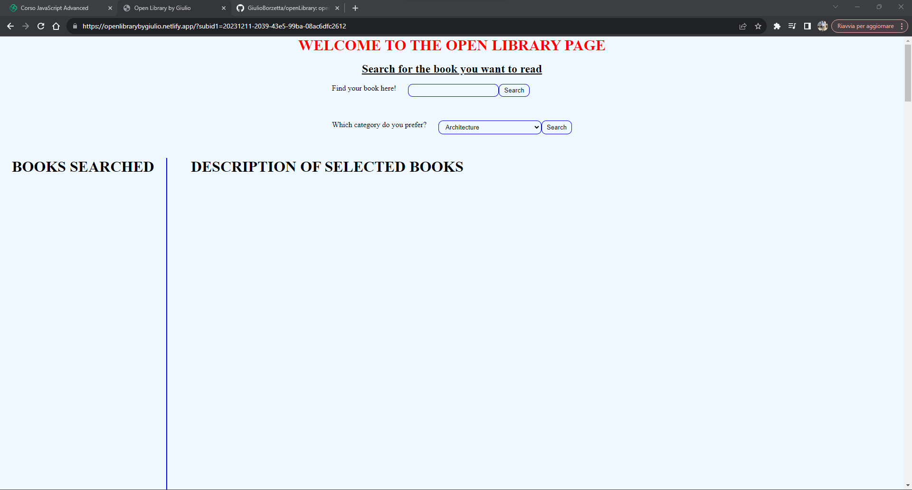

# 🚀 Benvenuti su Open Library Project by Giulio!

[Link per accedere al sito](https://openlibrarybygiulio.netlify.app/)

Questo codice è stato progettato con Webpack e utilizzando gli API di [openlibrary.org](https://openlibrary.org/)

* Come è strutturato il codice?

Nella prima foto si può vedere la schermata appena si apre la pagina.

Nella seconda foto si può vedere la schermata quando si va a cercare un libro e dopo aver cliccato il pulsante "Click here for desscription".

